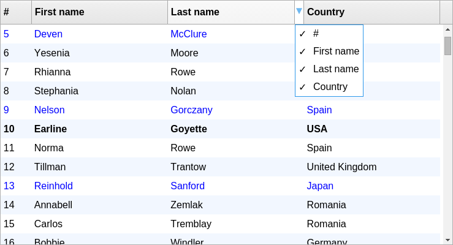

react-datagrid
=================

[](https://gitter.im/zippyui/react-datagrid?utm_source=badge&utm_medium=badge&utm_campaign=pr-badge&utm_content=badge)
[](https://circleci.com/gh/zippyui/react-datagrid)

> A carefully crafted DataGrid for React


See demo at [zippyui.github.io/react-datagrid](http://zippyui.github.io/react-datagrid)

<a href="http://zippyui.github.io/react-datagrid/#/examples/basic"></a>


## Supports both React 0.14 & 15

## Install

```sh
$ npm install react-datagrid --save
```

## Changelog

See [changelog](./CHANGELOG.md)

## Features

 * renders huge amounts of data
 * resizable columns
 * reorderable columns
 * remote data support
 * custom row/cell/column rendering
 * multiple/single selection
 * sorting
 * filtering
 * pagination
 * hideable columns
 * works on mobile

## Usage

Please include the stylesheet `index.css` in your project. If you are using `webpack` with `css-loader`, you can require it: `require('react-datagrid/index.css')`

#### NOTE:
For optimal performance, make sure you use `react-datagrid` with the **production version of React**, not the `dev` version. The `dev` version contains a lot of checks, which slow down grid scrolling/rendering quite a bit.

Of course for development, you can use React `dev` version, but this is just a warning so you won't be put off if you see some jank in `dev` mode. It will dissapear when you switch to `production` (minified) version. We are working on this, to make the datagrid usage experience as optimal as possible even in development.

#### Example
```jsx

var React = require('react')
var DataGrid = require('react-datagrid')

var data = [
  { id: '1', firstName: 'John', lastName: 'Bobson'},
  { id: '2', firstName: 'Bob', lastName: 'Mclaren'}
]
var columns = [
  { name: 'firstName'},
  { name: 'lastName'}
]

<DataGrid idProperty="id" dataSource={data} columns={columns} />

```

For more examples, see [examples site](http://zippyui.github.io/react-datagrid/#/examples/basic)

## Props

There are a lot of props that can be configured for the datagrid. We'll try to categorize them so they are easy to follow

#### Basic

 * `dataSource`: Array/String/Function/Promise - for local data, an array of object to render in the grid. For remote data, a string url, or a function that returns a promise.
 * `idProperty`: String - the name of the property where the id is found for each object in the data array
 * `columns`: Array - an array of columns that are going to be rendered in the grid

  Each column should have a `name` property, and optionally a `title` property. If no `title` property is specified, a humanized version of the column `name` will be used.

  * `name`: String
  * `title`: String/ReactElement - a title to show in the header. If not specified, a humanized version of `name` will be used. Can be a string or anything that React can render, so you can customize it as you please.
  * `render`: Function - if you want custom rendering, specify this property

    ```jsx
    var columns = [
      { name: 'index', render: function(v){return 'Index ' + v} }
    ]
    ```

  * `style`: Object - if you want cells in this column to be have a custom style
  * `textAlign`: String - one of 'left', 'right', 'center'

#### Sorting

Sorting the data array is not done by the grid. You can however pass in sort info so the grid renders with sorting icons as needed

 * onSortChange: Function(sortInfo)
 * sortInfo: Array - an array with sorting information

  Example
  ```jsx
  var sortInfo = [{name: 'firstName', dir: 'asc'}]
  var sorty = require('sorty')
  //sorty is a package which sorts an array on multiple properties

  function sort(arr){
    return sorty(sortInfo, arr)
  }

  function onSortChange(info){
    sortInfo = info
    data = sort(data)
    //now refresh the grid
  }

  var data = [...]

  data = sort(data)
  <DataGrid
    sortInfo={sortInfo}
    onSortChange={onSortChange}
    dataSource={data} idProperty='id' columns={columns} />
  ```

#### Columns

##### Column styling

Column customization/styling can be done with different properties on the column object:

* `style`: Object - a style object to be applied to all cells in this column
* `textAlign`: String - one of 'left', 'right', 'center'
* `className`: String - a className to be applied to all cells in this column.
* `render`: Function(value, data, cellProps) - if you want custom rendering, specify this property

```jsx
  var columns = [
    { name: 'index', render: function(v){return 'Index ' + v} }
  ]
```

The `column.render` function is called with 3 args:

* value - the default value to be rendered (equals to `data[column.name]`)
* data - the corresponding data object for the current row
* cellProps - an object with props for the current cell - has the following properties:
  * rowIndex - the index of the row
  * index    - the index of the column
  * style    - a style for the cell
  * className - a className for the cell

Example:

```jsx
var data = [...]
var columns = [
  {
    name: 'firstName',
    className: 'first-column',
    textAlign: 'center',
    style: { fontWeight: 'bold' }
  },
  {
    name: 'lastName',
    render: function(value){
      return <span>
        <b>Last name:</b> value
      </span>
    }
]
<DataGrid idProperty="id" dataSource={data} columns={columns} />
```

##### Column showing/hiding

When a column is shown/hidden, you can be notified using the `onColumnVisibilityChange` callback prop.

 * `onColumnVisibilityChange`: Function(column, visibility)

You can specify a column is visible/hidden with the following props on column objects:

 * defaultVisible: Boolean
 * visible: Boolean - controlled (which means you have to manually set column visibility when it changes, by using `onColumnVisibilityChange`)

If you prefer to use the "hidden" alternatives, you can use `defaultHidden` and `hidden`.

#####  Column reordering

If you want to enable column reordering, just specify the `onColumnOrderChange` prop on the grid:

* onColumnOrderChange: Function(index, dropIndex)

  Example
  ```jsx
  function handleColumnOrderChange(index, dropIndex){
    var col = columns[index]
    columns.splice(index, 1) //delete from index, 1 item
    columns.splice(dropIndex, 0, col)
    this.setState({})
  }

  <DataGrid onColumnOrderChange={handleColumnOrderChange} />
  ```

### Rows

#### Styling

 * `rowStyle`: Object/Function - you can specify either a style object to be applied to all rows, or a function. The function is called with `(data, props)` (so you have access to `props.index` for example) and is expected to return a style object.

 * `rowProps`: Object - props to be passed to all rows
    - `rowProps.overClassName` - a css class name to be applied when mouse is over the row
    - `rowProps.selectedClassName`
    - `rowProps.className`

 * `rowFactory`: Function - a factory function for rows. It can return `undefined` if you only want to change the `props` object passed to the function and rely on the default rendering.


#### Remote data

 * dataSource: String/Function/Promise if you specify a url to load remote data from, by default, pagination props are appended to the url as query params (pageSize, skip).

For an example, see [examples/restore-grid-state](http://zippyui.github.io/react-datagrid#/examples/restore-grid-state)

#### Pagination

 When you have remote data, pagination is setup by default. If you want to disable pagination, specify the `pagination` prop with a `false` value.

 * pagination: Boolean
 * defaultPageSize: Number
 * pageSize: Number - controlled alternative for `defaultPageSize`. When `pageSize` changes, `onPageSizeChange(pageSize)` is called
 * defaultPage: Number
 * page: Number - controlled alternative for `defaultPage`. When `page` changes, `onPageChange(page)` is called


## Contributing

Use [Github issues](https://github.com/zippyui/react-datagrid/issues) for feature requests and bug reports.

We actively welcome pull requests.

For setting up & starting the project locally, use:

```sh
$ git clone https://github.com/zippyui/react-datagrid
$ cd react-datagrid
$ npm install
$ npm run dev # or npm run hot
```

Now navigate to [localhost:9090](http://localhost:9090/)

If you want to have `react-hot-loader` enabled, and see code changes pushed instantly, without losing page state, use `npm run hot` instead of `npm run dev`.

Before building a new version, make sure you run

```sh
$ npm run build
```
which compiles the `src` folder (which contains jsx files) into the `lib` folder (only valid EcmaScript 5 files).

## License

#### MIT
